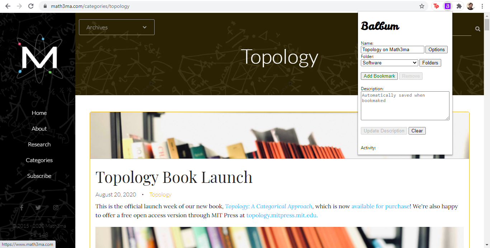
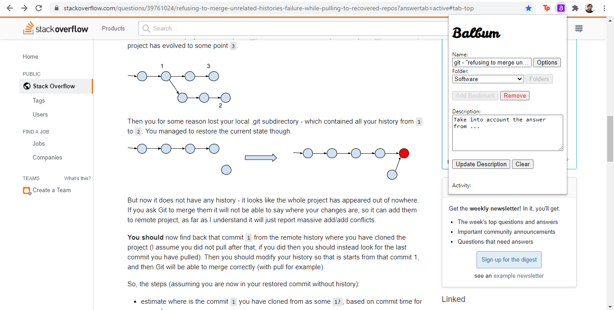
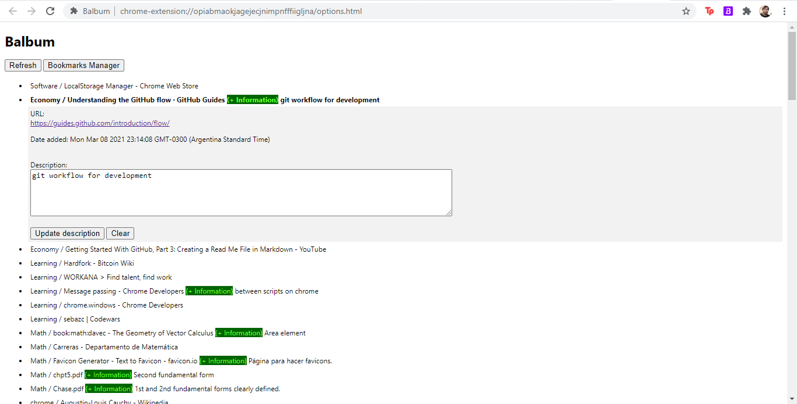

# Balbum

Balbum is an extension developed for Chrome browser. It lets you add a description to your bookmarks, so to remember *that particular thing* you saw in *that page* that caught your attention, and let you to bookmark it.

[comment]: <> (Following a few things to know about it: )

Features: 

* Balbum works hand in hand with Chrome bookmarks. Your current bookmarks are considered by the app, and new bookmarks will be considered by Chrome.
* Balbum stores data using localstorage.

# Use Cases

Bookmark a page you like:

Select a folder if necessary!

Add or update a description:

See your bookmarks and bookmarsk comments on them:

