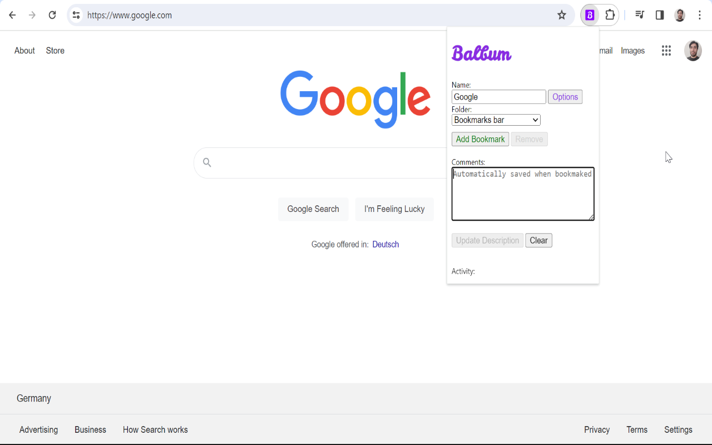

# Balbum

Balbum is an extension developed for chromium based browsers (like Chrome and Edge). It lets you add a description to your bookmarks, so to remember *that particular thing* you saw in *that page* that caught your attention.

[comment]: <> (Following a few things to know about it: )

Features: 

* Balbum works hand in hand with Chrome bookmarks. Your current bookmarks are considered by the app, and new bookmarks added from the extension will be considered by Chrome.
* Balbum stores data using localstorage.

# Download

Click on the image to be directed to the Chrome Web Store.

# Screenshots

Balbum's pop up:

Options page:

Updating a description in the options page:

Using the filters:

# Found any bug?

Please write me to seba.azc@gmail.com!