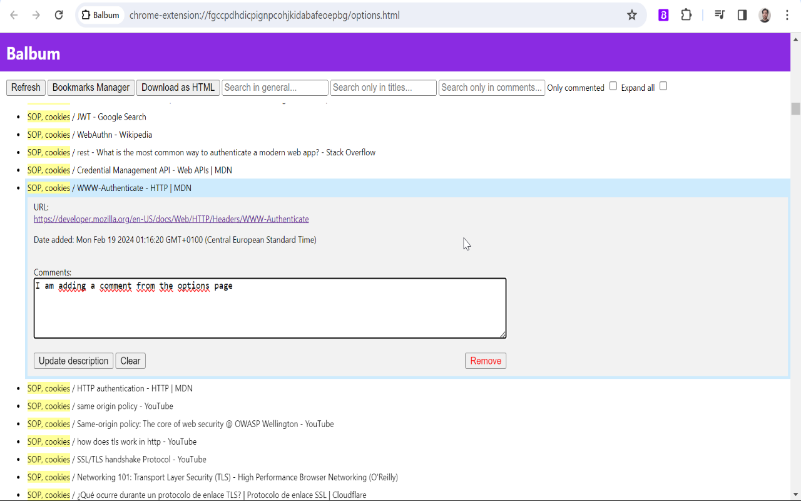

# Balbum

Balbum is an extension developed for chromium based browsers (like Chrome and Edge). It lets you add a description to your bookmarks, so to remember *that particular thing* you saw in *that page* that caught your attention.

[comment]: <> (Following a few things to know about it: )

Features: 

* Balbum works hand in hand with Chrome bookmarks. Your current bookmarks are considered by the app, and new bookmarks added from the extension will be considered by Chrome.
* Balbum stores data using localstorage.

# How to use it locally in your computer

As any extension which is not installed from the Chrome Web Store, it must be loaded to the browser as an extension manually. This can be done with the following steps:

1. In your pc, clone the github repository: ```git clone https://github.com/sebazc/Balbum.git```

1. In your browser, got to **chrome://extensions/**.

1. Then turn on **Developer mode**.

1. Click on **Load unpacked**.

1. Select the folder where the code was downloaded after the first step.

# Screenshots

Balbum's pop up:


Options page:


Updating a description in the options page:



Using the filters:


# Found any bug?

Please write me to seba.azc@gmail.com!